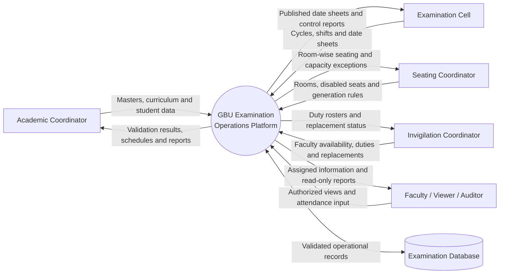
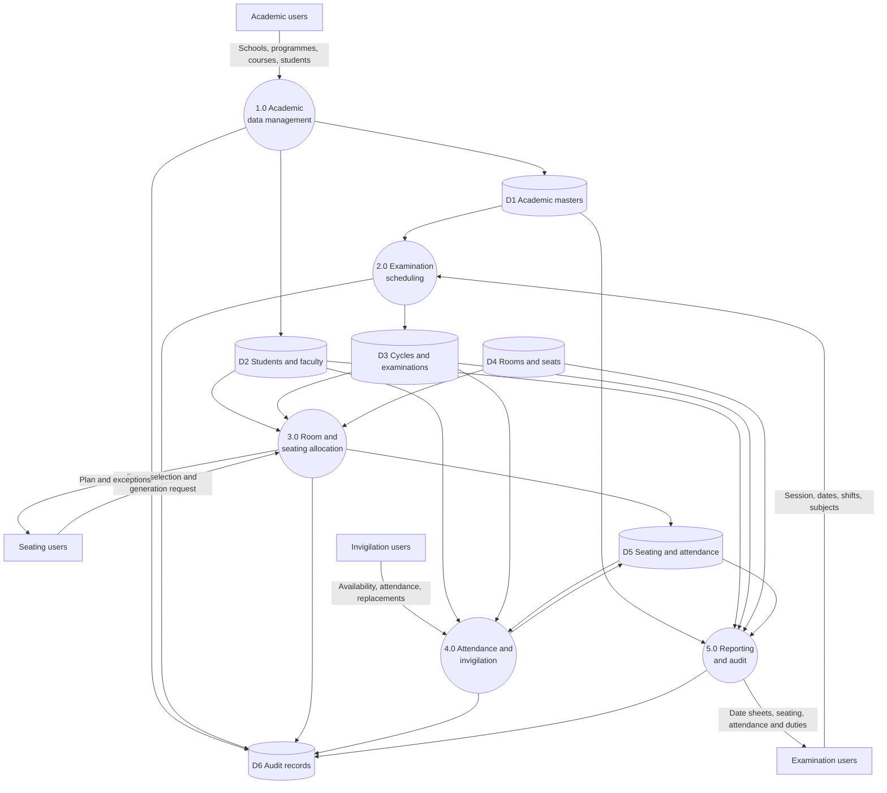
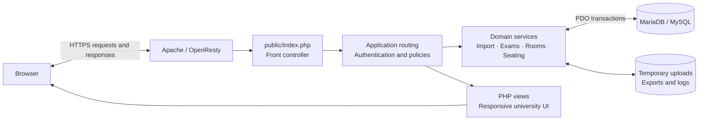

<div align="center">
  

  # Automated Examination Operations Platform

  **A role-governed university system for examination planning, date sheets, room layouts, seating allocation, attendance, invigilation, replacements, audit and reporting.**

  `PHP 8.2+` · `MariaDB / MySQL` · `Responsive UI` · `CSV/XLSX Imports` · `Print-ready Reports`
</div>

---

## About the application

The **GBU Examination Operations Platform** centralises the operational work required to conduct university examinations. It connects academic records, subject curricula, examination schedules, physical room layouts, student seating, attendance and faculty invigilation in one controlled workflow.

The system is designed for Gautam Buddha University and follows its school, programme and roll-number conventions. It replaces disconnected spreadsheets with validated imports, deterministic allocation, role-based access and an auditable record of operational changes.

### Core objectives

- Maintain reliable school, programme, subject, student, faculty and room master data.
- Build examination cycles, calendars, shifts and programme-wise date sheets.
- Model every physical seat and prevent disabled seats from being allocated.
- Generate reproducible room-wise seating plans with capacity exception reporting.
- Prepare attendance sheets, invigilation duties and replacement records.
- Produce university-ready print and CSV reports with a complete audit trail.

## Contents

- [System capabilities](#system-capabilities)
- [Operational workflow](#operational-workflow)
- [Data-flow diagrams](#data-flow-diagrams)
- [Architecture](#architecture)
- [Roles and access](#roles-and-access)
- [Data conventions](#data-conventions)
- [Database design](#database-design)
- [Local installation](#local-installation)
- [InfinityFree deployment](#infinityfree-deployment)
- [Demo data](#demo-data)
- [Testing](#testing)
- [Security](#security)

## System capabilities

| Module | Implemented capabilities |
|---|---|
| Dashboard | Operational statistics, quick actions and role-aware navigation |
| Academic masters | Schools, departments, programmes, batches and programme codes |
| Course structure | Course name, code, credits, UG/PG level, academic year, semester, mid/end-semester duration, category and scheduling priority by programme |
| Students | Individual records, large CSV/XLSX import, validation preview and programme detection |
| Faculty | Faculty master, bulk import, school association and availability |
| Rooms | Bulk room import, row/column geometry, visual layout, priority and disabled seats |
| Examination cycles | Academic session, examination type, calendar dates, shifts and lifecycle status |
| Date sheets | Manual/import scheduling, school-wise automatic generation, holidays, gaps, priorities, validation, locking, regeneration, approval, publication and CSV export |
| Seating | Versioned generation, room capacity use, seat allocation and unallocated-student reporting |
| Attendance | Room-wise attendance sheets, marking and correction support |
| Invigilation | Faculty duty allocation, session conflict control and workload tracking |
| Replacements | Replacement requests, approval status and replacement history |
| Reports | Seating, attendance, date-sheet and operational CSV/print outputs |
| Governance | Eight application roles, CSRF protection, session control and audit logs |

## Operational workflow


## Data-flow diagrams

### DFD Level 0 — system context



### DFD Level 1 — internal examination flow



## Architecture



### Project structure

```text
Auto-Exam-Main/
├── app/
│   ├── Academic/       Roll-number and student-domain logic
│   ├── Auth/           Authentication and role policies
│   ├── Exams/          Examination scheduling services
│   ├── Foundation/     Application, database, session and environment
│   ├── Import/         CSV/XLSX staging, validation and commit services
│   ├── Rooms/          Physical seat generation
│   ├── Seating/        Seating allocation engine
│   └── View/           View rendering
├── bootstrap/          Application bootstrap and autoloading
├── config/             Application and database configuration
├── database/           Schema, seed, upgrades and hosted demo seeds
├── deployment/         InfinityFree packaging resources
├── public/             Web entry point, CSS, JavaScript, icons and branding
├── resources/views/    Server-rendered application screens
├── storage/            Runtime data and import templates
├── tests/              Unit, integration and end-to-end verification
└── tools/              Repeatable dataset and deployment builders
```

## Roles and access

| Role | Main responsibility |
|---|---|
| System Administrator | Full system, users, roles, masters, operations and audit control |
| Controller of Examinations | Examination cycles, date sheets, seating publication, attendance and reports |
| Academic Coordinator | Academic masters, curriculum and student records |
| Seating Coordinator | Rooms, disabled seats, layouts, seating generation and reports |
| Invigilation Coordinator | Faculty, availability, duties, replacements and attendance operations |
| Faculty / Invigilator | Restricted authenticated faculty dashboard |
| Audit and Compliance Viewer | Read-only reports and audit history |
| Authorized Read-only Viewer | Dashboard and published operational reports |

Routes are checked against explicit permissions including `academic.manage`, `students.manage`, `rooms.manage`, `exams.manage`, `seating.manage`, `attendance.manage`, `invigilation.manage`, `reports.view`, `audit.view` and `users.manage`.

## Data conventions

### Student identifiers

The standard roll number contains nine characters:

```text
235UCS001
└┬┘└┬┘└┬┘
 │  │  └── Student sequence
 │  └───── Programme/branch code (UCS = B.Tech CSE)
 └──────── Admission identifier; first two digits represent admission year
```

Enrollment number is a separate ten-digit identifier, for example `2300100266`. Academic sessions use consecutive `YYYY-YYYY` format, such as `2026-2027`.

Student imports accept:

```text
Enrollment/Roll Number, Enrollment Number, Academic Session, Full Name,
Branch, Mobile Number, Address, Department, School,
Current Year of Study, Current Semester, Section
```

### Curriculum

Courses are associated with a programme and semester using a subject code, name and category. The included B.Tech CSE dataset provides **87 unique courses and 94 curriculum mappings** across eight semesters.

### Rooms and disabled seats

Each room defines rows, columns and either `row_major` or `column_major` allocation order. Seats use labels such as `R01-C01`. Disabled coordinates remain visible in the room layout but cannot receive a student allocation.

### Imports

- Supported formats: CSV and first-worksheet XLSX.
- Maximum application-level size: 10 MB.
- Imports are staged and validated before commit.
- Invalid rows remain visible with row-specific messages.
- InfinityFree deployments can process the PHP temporary upload when persistent file writes are unavailable.

## Database design

The current schema contains **34 tables** grouped into these domains:

| Domain | Principal tables |
|---|---|
| Identity and governance | `roles`, `users`, `audit_logs`, `system_settings` |
| Academic masters | `schools`, `departments`, `programmes`, `batches`, `courses`, `programme_courses` |
| People | `students`, `faculty`, `faculty_availability` |
| Physical infrastructure | `rooms`, `room_seats` |
| Examination planning | `exam_cycles`, `exam_shifts`, `exam_calendar_dates`, `examinations`, `examination_cohorts`, `exam_eligibility`, `scheduling_rules`, `scheduling_runs`, `scheduling_run_items`, `scheduling_conflicts` |
| Seating | `seating_allocations`, `seating_assignments`, `seating_unallocated` |
| Operations | `invigilation_allocations`, `attendance`, `replacement_requests` |
| Imports | `import_batches`, `import_rows`, `import_errors` |

The canonical sources are [`database/schema.sql`](database/schema.sql) and [`database/seed.sql`](database/seed.sql).

## Local installation

### Requirements

- PHP 8.2 or newer with PDO MySQL and ZIP support
- MariaDB 10.4+ or MySQL 8+
- Apache with `mod_rewrite`
- XAMPP is recommended for Windows development

### Setup on XAMPP

1. Place the project at `C:\xampp\htdocs\Auto-Exam-Main`.
2. Start Apache and MySQL from XAMPP.
3. Copy `.env.example` to `.env` and review the database values.
4. Install the schema, seed data and administrator account:

```powershell
C:\xampp\php\php.exe database\install.php admin "a-strong-password-of-at-least-12-characters"
```

5. For a fresh manual installation, import the two canonical SQL files in this order:

```powershell
C:\xampp\mysql\bin\mysql.exe -u root -e "source C:/xampp/htdocs/Auto-Exam-Main/database/schema.sql"
C:\xampp\mysql\bin\mysql.exe -u root -D gbu_exam_operations -e "source C:/xampp/htdocs/Auto-Exam-Main/database/seed.sql"
```

6. Open [http://localhost/Auto-Exam-Main/public/](http://localhost/Auto-Exam-Main/public/).

### Environment configuration

```env
APP_NAME="GBU Examination Operations"
APP_ENV=local
APP_DEBUG=true
APP_URL=http://localhost/Auto-Exam-Main/public
APP_TIMEZONE=Asia/Kolkata
SESSION_TIMEOUT_MINUTES=30
SESSION_SAVE_PATH=

DB_HOST=127.0.0.1
DB_PORT=3306
DB_DATABASE=gbu_exam_operations
DB_USERNAME=root
DB_PASSWORD=
```

Never commit the live `.env` file or database credentials.

## InfinityFree deployment

Build the hosting package:

```powershell
.\deployment\infinityfree\build-package.ps1
```

The generated archive separates:

- `UPLOAD_TO_HTDOCS/` — application files placed directly inside the hosted `/htdocs` directory.
- `SETUP/` — database import, upgrades and optional demonstration seeds; this directory is not uploaded publicly.

For a clean hosted installation, select the provider-assigned database in phpMyAdmin and import `infinityfree_database_import.sql`. The hosted `.env` must use the exact InfinityFree MySQL hostname, database name, username and password; the database host is not `localhost`.

## Demo data

CSV demonstration datasets remain available under `storage/demo-data`. Database installation uses only the canonical `database/schema.sql` and `database/seed.sql` files.

## Testing

Run parser and role-policy tests:

```powershell
C:\xampp\php\php.exe -d zend.assertions=1 -d assert.exception=1 tests\RollNumberParserTest.php
C:\xampp\php\php.exe -d zend.assertions=1 -d assert.exception=1 tests\RolePolicyTest.php
```

Run database-backed verification while MariaDB is available:

```powershell
C:\xampp\php\php.exe -d zend.assertions=1 -d assert.exception=1 tests\SeedTest.php
C:\xampp\php\php.exe -d zend.assertions=1 -d assert.exception=1 tests\CourseImportTest.php
C:\xampp\php\php.exe -d zend.assertions=1 -d assert.exception=1 tests\RoomImportTest.php
C:\xampp\php\php.exe -d zend.assertions=1 -d assert.exception=1 tests\BTechCseCurriculumDatasetTest.php
C:\xampp\php\php.exe -d zend.assertions=1 -d assert.exception=1 tests\EndToEndTest.php
C:\xampp\php\php.exe -d zend.assertions=1 -d assert.exception=1 tests\AutomaticSchedulingTest.php
```

Database-backed tests create isolated temporary databases and remove them after completion.

## Security

- Passwords are stored using PHP password hashing and verified with `password_verify`.
- Every protected route requires authentication and an authorized role permission.
- State-changing forms use CSRF tokens.
- Sessions use secure, HTTP-only, SameSite cookies where HTTPS is available.
- Login attempts receive a short session-based throttle.
- Operational changes are retained in the audit log.
- Output is HTML-escaped through shared view helpers.
- Database access uses PDO prepared statements and transactions.

Before production use, change temporary credentials, keep `APP_DEBUG=false`, use HTTPS, protect the hosting account and retain encrypted database backups outside the public web root.

## Reporting and printing

Print actions use the browser print dialog; choose **Save as PDF** for official PDF output. CSV exports are UTF-8 compatible and can be opened in spreadsheet applications. Always review the university header, examination cycle, date, shift, room and publication status before distribution.

---

<div align="center">
  <strong>Gautam Buddha University — Examination Operations</strong><br>
  Greater Noida, Uttar Pradesh, India
</div>
